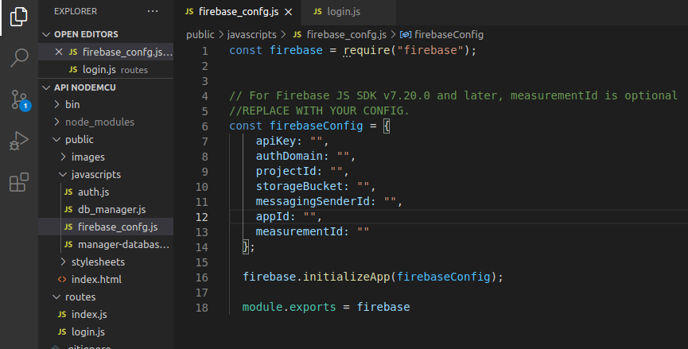

# API NodeMCU

API made in NodeJS (Express) to connect a NodeMCU card to the Firebase Realtime Database. Collecting the following data from the board: -Local (latitude and longitude) -Position of 4 pins. -And the safe state (safe state based on location, Lat + Lon).


### Project Configuration

First you need to install [NodeJS](https://nodejs.org/en/), then you need to install the following NPM packages:

```
npm install express
npm install path
npm install cookie-parser
npm install morgan
npm install firebase
```


And you need to replace the configuration in the project, precisely the configuration of the Firebase API, in firebase_config.js. You can find your correct configuration on the Firebase Dashboard.




## API Test

In this [link](https://www.getpostman.com/collections/c9bb03c2d913c29fddd7) you can test the API calls, through this documentation available on Postman. The API is currently hosted on the [Heroku](https://www.heroku.com) platform.

